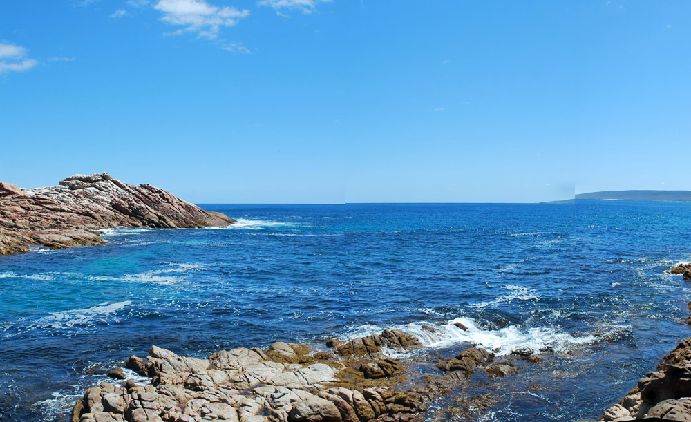
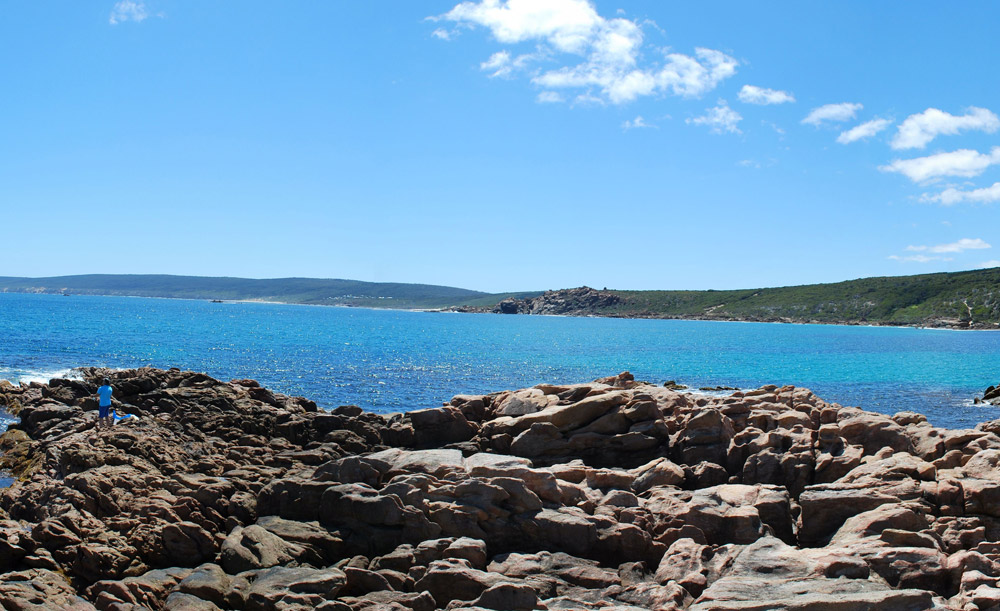
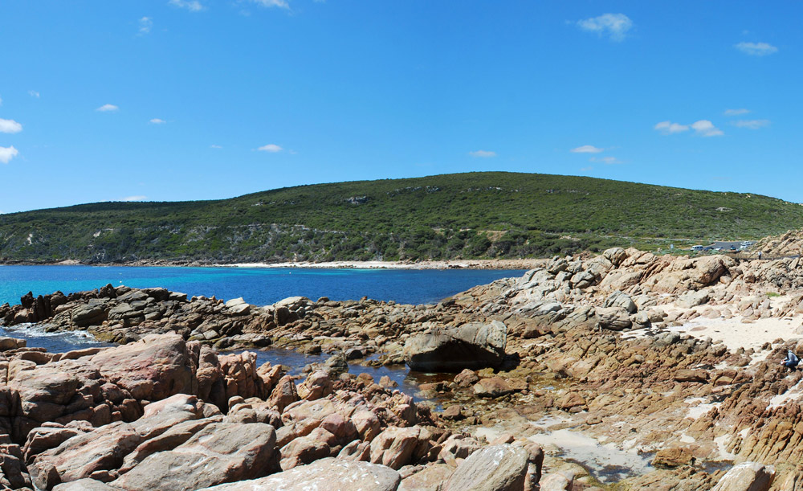

# jQuery Cyclorama

## [Demo](http://yashkin.by/cyclorama/)

## Usage

Include `jquery.cyclorama.css` and `jquery.cyclorama.js` in document head. Make sure you also load the jQuery library:

```html
<script src="http://code.jquery.com/jquery-1.9.1.min.js"></script>
<link rel="stylesheet" href="css/jquery.cyclorama.css">
<script src="js/jquery.cyclorama.js"></script>
```

Insert this code in document body:

```html
<div class="cyclorama">
    <div class="pan-inner">
        <div class="pan-content">
            <!-- put 360° panorama image(s) here -->
            
            
            
            
            
        </div>
    </div>
    <button class="pan-left"></button>
    <button class="pan-right"></button>
    <div class="pan-percentage">
        <div class="pan-runner"></div>
    </div>
</div>
```

Attach Cyclorama when the document is loaded:

```javascript
jQuery(function($) {
    $('.cyclorama').cyclorama();
});
```

With keyboard support (left and right arrows):

```javascript
jQuery(function($) {
    $('.cyclorama').cyclorama({
        useKeyboard: true
    });
});
```

## Notes

You are need to set `.pan-content` width with CSS or JS before initializing Cyclorama.

## License

This plugin is available under [the MIT license](http://opensource.org/licenses/MIT).

Panorama image from [Androids & Photography](http://androidforensicphotography.wordpress.com/2012/07/01/a-full-360-degree-panorama-of-canal-rocks-south-west-of-western-australia/).
